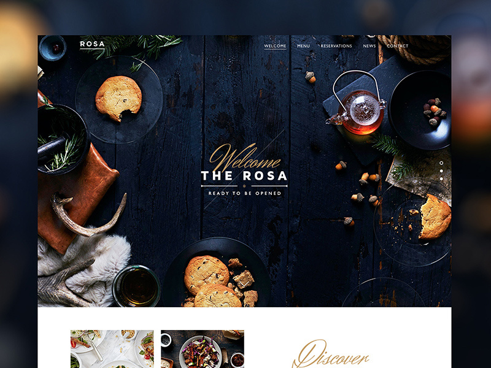

<h1 align="center">
    Rosa Restaurante
</h1>

  

  

  

## Layout

  

To access the layout use [Figma](https://dribbble.com/shots/1560982-Rosa-Restaurant-Website).

Made with ♥ by Isaque Igor :wave: [Get in touch!](https://www.linkedin.com/in/isaqueigor/)
